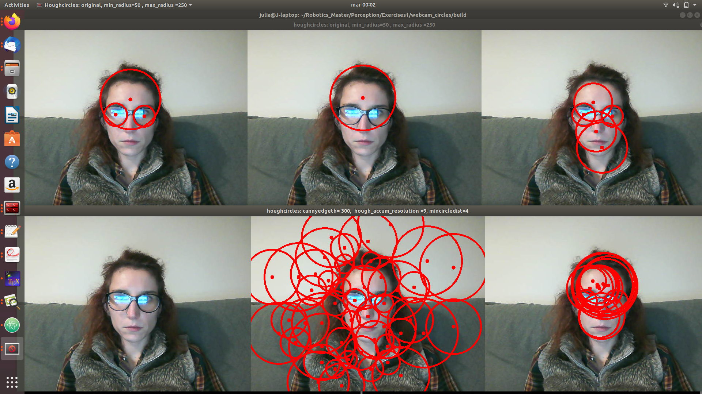

# webcam_circles
Circle detection from online webcam images
Find out information about how The Hough Transform works, and interpret and explain  the behaviour when changing the parameters. Document your Readme.md and cite the used references

As we can see in the code, we use the following functions:

1. First it applies function [GaussianBlur](https://docs.opencv.org/2.4/modules/imgproc/doc/filtering.html?highlight=gaussianblur#gaussianblur).
This function blurs an image using a Gaussian filter.
It has the following parameters:
*cv::GaussianBlur*( gray_image, gray_image, cv::Size(GAUSSIAN_BLUR_SIZE, GAUSSIAN_BLUR_SIZE), GAUSSIAN_BLUR_SIGMA )
  - **gray_image** --> is the input and the output image.
  - **Size(GAUSSIAN_BLUR_SIZE, GAUSSIAN_BLUR_SIZE)** -> Gaussian kernel size, defined in the header of the code: 7.
  - **GAUSSIAN_BLUR_SIGMA** -> sigmaX = sigmaY. Gaussian kernel standard deviation in X direction, defined in the header of the code: 2.

2. Apply the Hough Transform to find the circles, using the function [HoughCircles](https://docs.opencv.org/2.4/doc/tutorials/imgproc/imgtrans/hough_circle/hough_circle.html)
The Hough Circle Transform is used to detect circles over an image. In the circle case, we need three parameters to define a circle:
  - *x_{center}*
  - *y_{center}*
  - *radius*

The function **cv::HoughCircles**( gray_image, circles, CV_HOUGH_GRADIENT, HOUGH_ACCUM_RESOLUTION, MIN_CIRCLE_DIST, CANNY_EDGE_TH, HOUGH_ACCUM_TH, MIN_RADIUS, MAX_RADIUS ) [HoughCircles](https://docs.opencv.org/2.4/modules/imgproc/doc/feature_detection.html?highlight=houghcircles#houghcircles)
To use it, it needs the following parameters:
  - **gray_image** -> a grayscale input images
  - **circles** -> output vector of found circles
  - **CV_HOUGH_GRADIENT** -> The detection method to use, 21HT method, described in [21HT](https://docs.opencv.org/2.4/modules/imgproc/doc/feature_detection.html?highlight=houghcircles#yuen90).
  - **HOUGH_ACCUM_RESOLUTION** -> Inverse ratio of the accumulator resolution to the image resolution.
  - **MIN_CIRCLE_DIST** -> Minimum distance between the centers of the detected circles
  - **CANNY_EDGE_TH** -> higher threshold of the two passed to the Canny() edge detector (the lower one is twice smaller).
  - **HOUGH_ACCUM_TH** -> it is the accumulator threshold for the circle centers at the detection stage
  - **MIN_RADIUS** ->   minRadius – Minimum circle radius.
  - **MAX_RADIUS** ->   Maximum circle radius.

  3. Here computes each circle in vector *circles* and plot them its center and its radius.

  `for(unsigned int ii = 0; ii < circles.size(); ii++ )
  {
      if ( circles[ii][0] != -1 )
      {
              center = cv::Point(cvRound(circles[ii][0]), cvRound(circles[ii][1]));
              radius = cvRound(circles[ii][2]);
              cv::circle(image, center, 5, cv::Scalar(0,0,255), -1, 8, 0 );// circle center in green
              cv::circle(image, center, radius, cv::Scalar(0,0,255), 3, 8, 0 );// circle perimeter in red
      }
  }`

## FunctionCreated

**compute_circle** -> this function contains the houghcircles algorithm.

## OUTPUT

In the picture appears the original parameters, changing:
1. Original image
2. Setting minimum radius of 50, it shows bigger circles, and smaller circles disappear.
3. Setting maximum radius of 250, it shows bigger circles.

1. Setting cannyedgeth of 300, as is bigger, any circle appears.;
2. Setting hough_accum_resolution of 9, it appear lots of circle.
3. Setting min_circle_dist=4, it appears closer circles.

## Run the code

1. Make a new directory named build
2. Go to build directory and execute *cmake ..* and then *make*.
3. Run file *./webcam_capture* - (you have to have a webcam previously installed).
